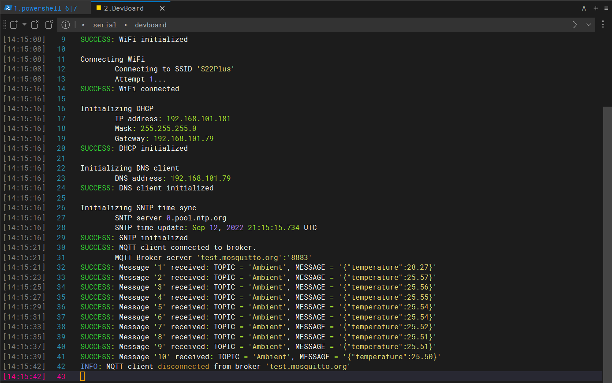

# Azure IoT Hub

This sample shows how to exchange data between client and server using MQTT protocol in an encrypted mode supporting TLS v1.2.

## Configurations

All Azure IoT hub and Wi-Fi configurations are in `azure_config.h`.

### Use X.509 certificate

Follow [Provision multiple X.509 devices](https://learn.microsoft.com/azure/iot-dps/tutorial-custom-hsm-enrollment-group-x509?tabs=linux) to prepare private keys and certfications used by DPS for [group enrollment](https://learn.microsoft.com/azure/iot-dps/concepts-service#enrollment-group).

> This is an optional step if you do not need to use your own X.509. The sample project itself has a default X.509 certificate be placed in `mosquitto.cert.h`.

To make an encrypted connection with MQT T server, user should follow these steps to add an x509 certificate to the _mqtt_client_ and use it to ensure server's authentication :

1. Download certificate a uthority CA (in this application "mosquitto.org.der" downloaded from [test.mosquitto](https://test.mosquitto.org)

1. Convert certificate downloaded by executing the following cmd from the file downloaded path :

   ```bash
   openssl x509 / rsa -inform pem -in CERTIFICATE.pem -outform der -out CERTIFICATE.der

   xxd -i mosquitto.org.der > mosquitto.cert.h
   ```

   > `xxd` for Windows can be download from https://sourceforge.net/projects/xxd-for-windows/

1. Replace content from the converted file under the application: `mosquitto.cert.h`.

## Build the project

### Windows

1. Launch Powershell terminal.

1. Compile using CMake.

   ```ps
   .\tools\rebuild.bat
   ```

1. Flash using OpenOCD

   ```ps
   .\tools\flash.bat
   ```

### Linux or WSL2

1. Launch Bash terminal.

1. Compile using CMake.

   ```ps
   ./tools/rebuild.sh
   ```

1. Flash using OpenOCD

   ```ps
   ./tools/flash.sh
   ```

## Expected success behavior

1. Configure your hyperterminal (e.g [Termite](https://www.compuphase.com/software_termite.htm), [TeraTerm](http://www.teraterm.org/)) as:

   ```txt
   BaudRate = 115200 baud
   Word Length = 8 Bits
   Stop Bit = 1
   Parity = None
   Flow control = None
   ```

1. Open hyperterminal, press the **Reset** button on the board to view serial output:

   

## Debug the project

1. Run OpenOCD

   ```bash
   openocd.exe -f interface/stlink.cfg -f target/stm32f4x.cfg -c "bindto 0.0.0.0" -c "init" -c "reset init"
   ```

1. In VSCode, launch `MXChip: Remote` as debug target to attach the GDB with it.

1. After successfully launched, the GDB will stop at the `main()` function.
