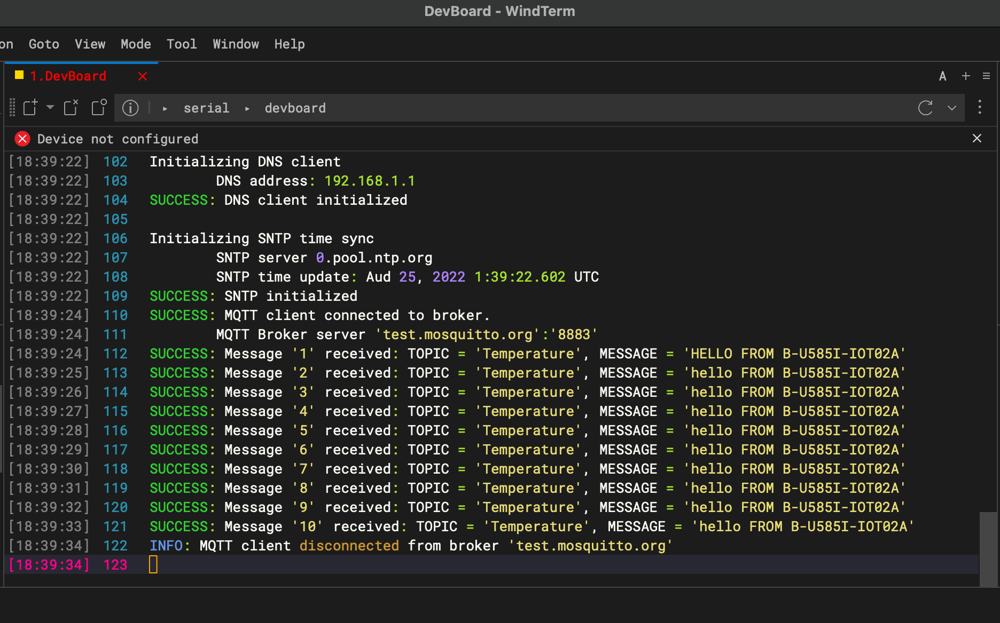

# MQTT Client

This sample shows how to exchange data between client and server using MQTT protocol in an encrypted mode supporting TLS v1.2.

## Configurations

All MQTT broker and Wi-Fi configurations are in `mqtt_config.h`.

### Use X.509 certificate

To make an encrypted connection with MQTT server, user should follow these steps to add an x509 certificate to the _mqtt_client_ and use it to ensure server's authentication :

1. Download certificate authority CA (in this application "mosquitto.org.der" downloaded from [test.mosquitto](https://test.mosquitto.org)

1. Convert certificate downloaded by executing the following cmd from the file downloaded path :

    ```bash
    xxd -i mosquitto.org.der > mosquitto.cert.h
    ```

1. Add the converted file under the application: `samples/mqtt_client/mosquitto.cert.h`.

## Build the project

1. Compile using CMake.

    ```bash
    cmake -Bbuild -GNinja -DCMAKE_TOOLCHAIN_FILE="../../cmake/arm-gcc-cortex-m4.cmake"

    cmake --build build
    ```

1. Flash using OpenOCD

    ```bash
    openocd -f interface/stlink.cfg -f target/stm32f4x.cfg -c "program build/mxchip_mqtt_client.elf verify" -c "reset halt" -c "shutdown"
    ```

## Expected success behavior

1. Configure your hyperterminal (e.g TeraTerm) as:

    ```json
    BaudRate = 115200 baud
    Word Length = 8 Bits
    Stop Bit = 1
    Parity = None
    Flow control = None
    ```

1. Open hyperterminal to view serial output

    

## Debug the project

1. Run OpenOCD

    ```bash
    openocd.exe -f interface/stlink.cfg -f target/stm32f4x.cfg -c "bindto 0.0.0.0" -c "init" -c "reset init"
    ```

1. In VSCode, launch `MXChip: Remote` as debug target to attach the GDB with it.

1. After successfully launched, the GDB will stop at the `main()` function.
